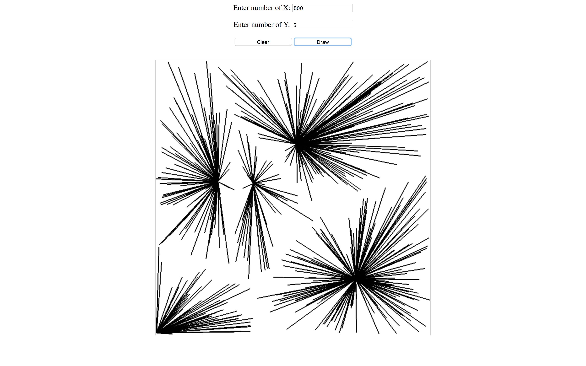

# Gravity_JavaScript

 There is  X number of demand of points (akin to customers) and Y number of supplier points. X will be supplied by closest Y

 X and Y numbers should be user definable but in the prototype use something small like 100 Demand Points and 5 Supply Points.

 The results is a Window with lines between the chosen supply point and customer node.
